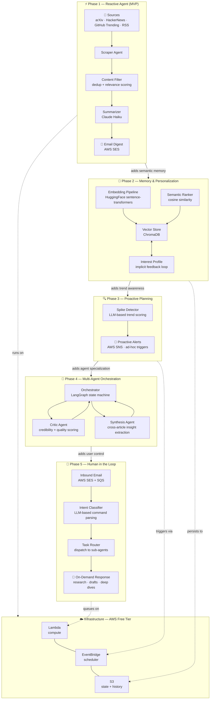

# AI Research Analyst Agent

An autonomous multi-agent system that monitors the AI/ML research landscape, summarises daily developments, and delivers personalised digests. Built progressively across 5 phases to demonstrate core agentic AI patterns — from a simple reactive pipeline to a fully autonomous, multi-agent system with human-in-the-loop control.

> **Portfolio project** — each phase is independently shippable and introduces a new agentic concept. 

---

## What it does

- Scrapes arXiv, HackerNews, GitHub Trending, and RSS feeds daily
- Uses an LLM to score relevance, deduplicate, and summarise articles
- Delivers a personalised email digest each morning
- Learns your interests over time via a vector-based interest profile
- Detects topic spikes and fires proactive alerts before the daily digest
- Accepts natural language commands via email reply for on-demand research

---

## Architecture & roadmap



---

## Phase breakdown

| Phase | Capability | Agentic concept introduced | Status |
|-------|-----------|---------------------------|--------|
| 1 | Scheduled scrape → summarise → email | Tool use, prompt engineering | 🔨 In progress |
| 2 | Personalised ranking via interest profile | RAG, vector memory, persistent state | 📋 Planned |
| 3 | Real-time spike detection & proactive alerts | Agent planning, event-driven action | 📋 Planned |
| 4 | Specialised sub-agents with LangGraph orchestrator | Multi-agent systems, state machines | 📋 Planned |
| 5 | Reply-to-email command interface | Human-in-the-loop, intent classification | 📋 Planned |

---

## Tech stack

| Layer | Technology | Why |
|-------|-----------|-----|
| LLM | Claude Haiku | Cheapest quality model — full system runs under $5/month |
| Orchestration | LangGraph | Low-level control over agent state and transitions |
| Vector store | ChromaDB | Embedded, no server needed, persists to S3 |
| Embeddings | HuggingFace `sentence-transformers` | Free, runs in Lambda |
| Compute | AWS Lambda | Serverless, stays within Free Tier at this volume |
| Scheduler | AWS EventBridge | Cron-style triggers for daily digest and spike checks |
| Email out | AWS SES | Free Tier covers 62,000 emails/month |
| Email in | AWS SES + SQS | Inbound email routing for Phase 5 HITL |
| State | AWS S3 | Cheap, durable, accessible from Lambda |
| IaC | AWS SAM | Declarative Lambda + event definitions |

---

## Project structure

```
ai-research-analyst/
├── agents/
│   ├── scraper/           # Phase 1 — fetches from all sources
│   │   ├── agent.py       # orchestrates and deduplicates
│   │   └── sources/       # arxiv.py, hackernews.py, github_trending.py, rss.py
│   ├── summarizer/        # Phase 1 — Claude Haiku, batched prompt
│   ├── ranker/            # Phase 2 — cosine similarity vs interest profile
│   ├── critic/            # Phase 4 — credibility + quality scoring
│   ├── synthesizer/       # Phase 4 — cross-article insight extraction
│   └── orchestrator/      # Phase 4 — LangGraph state machine
├── memory/                # Phase 2
│   ├── vector_store.py    # ChromaDB wrapper, S3 persistence
│   ├── interest_profile.py
│   └── seen_articles.py   # dedup index
├── detectors/             # Phase 3
│   └── spike_detector.py  # LLM-based trend scoring
├── delivery/
│   ├── email_digest.py    # Phase 1 — SES digest
│   ├── alert.py           # Phase 3 — SNS proactive alerts
│   ├── response.py        # Phase 5 — on-demand replies
│   └── templates/         # Jinja2 HTML email templates
├── handlers/              # Lambda entry points (thin wrappers only)
│   ├── daily_digest.py    # Phase 1 — EventBridge daily trigger
│   ├── spike_check.py     # Phase 3 — EventBridge 30-min trigger
│   └── inbound_email.py   # Phase 5 — SES inbound → SQS → HITL
├── infra/
│   ├── template.yaml      # AWS SAM — Lambda, EventBridge, SES, S3, SQS
│   └── samconfig.toml
├── tests/
│   ├── unit/
│   ├── integration/
│   └── fixtures/          # sample_articles.json
├── scripts/
│   ├── run_local.py       # run full pipeline without Lambda
│   ├── seed_interests.py  # bootstrap the interest profile
│   └── test_email.py      # preview digest in browser
├── tasks/                 # Claude Code permenant memory
|   ├── todo.md            # Current plan - at the completion will be renamed with ticket and descriptive name
|   └── lessons.md         # Place to store lessons from things that had to be corrected
├── pyproject.toml
└── .env.example
└── CLAUDE.md              # Project level instructions for Claude Code
```

---

## Getting started

### Prerequisites

- Python 3.11+
- AWS account (Free Tier is sufficient)
- Anthropic API key

### Local setup

```bash
# Clone the repository
git clone https://github.com/yourname/ai-research-analyst
cd ai-research-analyst

# Create and activate a virtual environment (Windows)
python -m venv venv
venv\Scripts\activate

# Install dependencies
pip install -e ".[dev]"

# Configure environment
cp .env.example .env
# Edit .env — add ANTHROPIC_API_KEY and AWS credentials

# Seed your interest profile
python scripts/seed_interests.py

# Run the full pipeline locally (no Lambda, no email send)
python scripts/run_local.py

# Preview the email digest in your browser
python scripts/test_email.py
```

### Deploy to AWS

```bash
# Install AWS SAM CLI
brew install aws-sam-cli   # or see https://docs.aws.amazon.com/serverless-application-model

# Build and deploy
cd infra
sam build
sam deploy --guided
```

### Run tests

```bash
pytest tests/unit/
pytest tests/integration/ -m integration   # requires .env
```

---

## Design principles

**Progressively capable.** Each phase is independently shippable and useful on its own. Phase 1 is a working product; every subsequent phase extends it without breaking it.

**Deliberately low cost.** The full stack targets under $5/month using AWS Free Tier plus Claude Haiku. Every infrastructure and model choice is documented with its cost tradeoff.

**Architecturally transparent.** Every design decision is recorded with its rationale. `handlers/` are kept thin and delegate immediately to `agents/` so the pipeline is fully testable without Lambda. Sources are individual files so adding a new one is additive, not a surgery on existing code.

**Production-minded.** Real infrastructure, real scheduling, real email delivery — not a notebook demo. The goal is a system you can show running in production during an interview.

---

## Cost estimate

| Service | Usage | Monthly cost |
|---------|-------|-------------|
| Claude Haiku | ~30 articles/day × 500 tokens | ~$0.50 |
| AWS Lambda | <10,000 invocations/month | Free Tier |
| AWS EventBridge | <1M events/month | Free Tier |
| AWS SES | <1,000 emails/month | Free Tier |
| AWS S3 | <5GB storage | Free Tier |
| AWS SQS | <1M requests/month | Free Tier |
| **Total** | | **~$0.50–$5/month** |

---

## Extending the project

Possible next steps beyond Phase 5:

- **Slack integration** — deliver digests and accept commands via a Slack bot
- **Web UI** — a simple read-only dashboard showing article history and interest profile drift
- **A/B prompt testing** — compare summarization quality across prompt versions using stored feedback
- **Multi-user support** — per-user interest profiles and delivery preferences stored in DynamoDB

---

## Acknowledgements

Built as a portfolio project to demonstrate agentic AI system design. Architecture and tech stack choices are deliberate and documented — see [ARCHITECTURE.md](./ARCHITECTURE.md) for the full design decision log.
