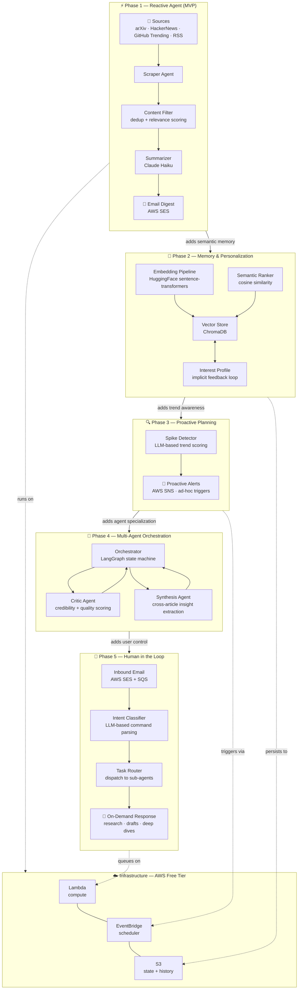

# AI Research Analyst Agent — Architecture & Roadmap

This project is built in progressive phases, each introducing a new layer of agentic capability. The goal is to move from a simple reactive pipeline to a fully autonomous, multi-agent system with human-in-the-loop control.



---

## Phase breakdown

| Phase | Capability added | Key agentic concept | New tech |
|-------|-----------------|---------------------|----------|
| 1 | Scheduled scrape → summarize → email | Tool use, prompt engineering | Lambda, EventBridge, SES, Claude Haiku |
| 2 | Personalized ranking via interest profile | RAG, vector memory | ChromaDB, sentence-transformers |
| 3 | Real-time spike detection & proactive alerts | Agent planning, event-driven action | LLM trend scoring, SNS |
| 4 | Specialized sub-agents with orchestrator | Multi-agent systems | LangGraph |
| 5 | Reply-to-email command interface | Human-in-the-loop, intent classification | SES inbound, SQS, async Lambda |

## Design principles

- **Progressively capable** — each phase is independently shippable and useful
- **Deliberately low cost** — full stack targets <$5/month using AWS Free Tier + Claude Haiku
- **Architecturally transparent** — every design decision is documented with its tradeoffs
- **Production-minded** — real infrastructure, not a notebook demo
```
